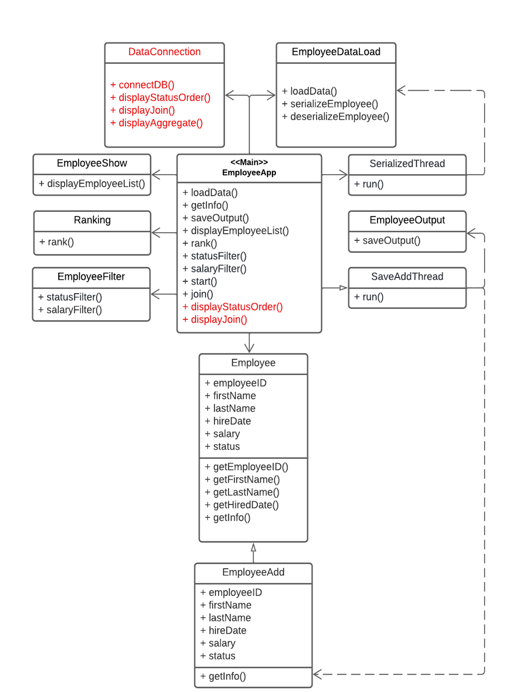
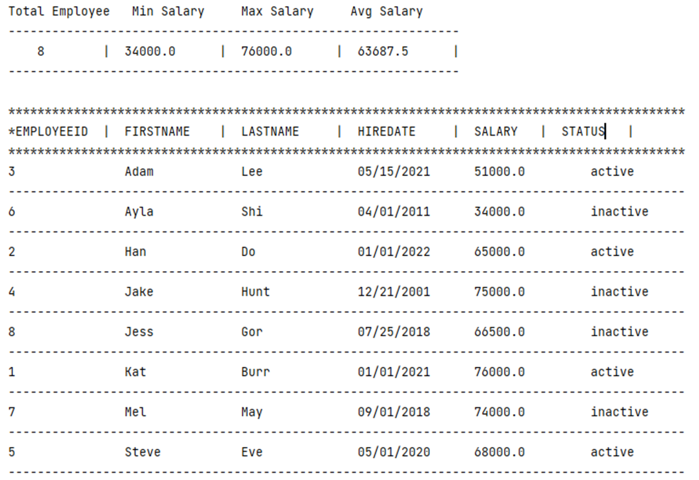

# Employee Information Management System Project

This project is to add new employee information to the system. The program stores employee’s Data such as id, 
name, hired date, status, and salary info. A Manager can view employee info in the department, search 
employee names or departments. The user responds to the main options from the main menu to use the system. 
The main object of the program is to track the record of employees and replace the Excel sheets of employees.

The project runs from the class EmployeeApp main() method. The program initiates the main menu that
prompts a user to select the option from the main menu. A user enters an employee's information and 
views an employee.

### Project Requirements
The application should implement advanced Java concepts, which include in the following concepts:
1. Abstract Class, Polymorphism, Inheritance
2. Exception Handling
3. Generic Class & Collection 
4. Single Responsibility Principle
5. Serialization
6. Write Input/Output of Binary File
7. Lambdas and Streams
8. Concurrency(Thread/Runnable)
9. DB Connection/SQL Lite - store/read data from a database
10. JUnit Testing

### Class Model & Design

### Sample of the output program:

File successfully loaded using Serialization

		*******************************************
		  Employee Information Management System
		*******************************************

1. Press 1: To Add an Employee Details
2. Press 2: To See an Employee Details
3. Press 3: To Sort Employee by Salary
4. Enter 4: To Filter Employee Info
5. Enter 5: To Update Employee Info
6. Enter 6: Connect/View Database
7. Press 7: To Exit the EIMS Portal

Please Enter choice: 6

###Database Menu

Choose your option below to view employees information in the DB
1. Display employees in status order
2. Display Join & Aggregate Employee Info
3. Back to main menu

Please enter the option above: 2

